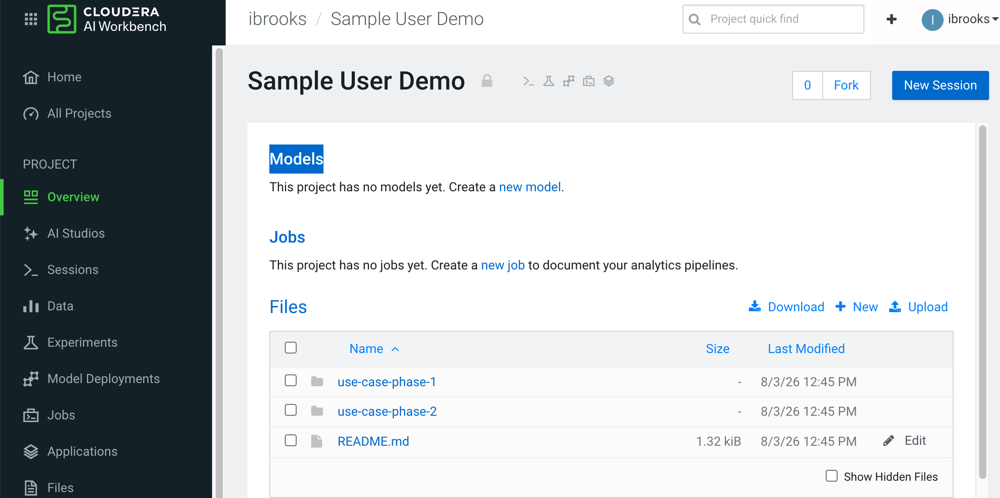
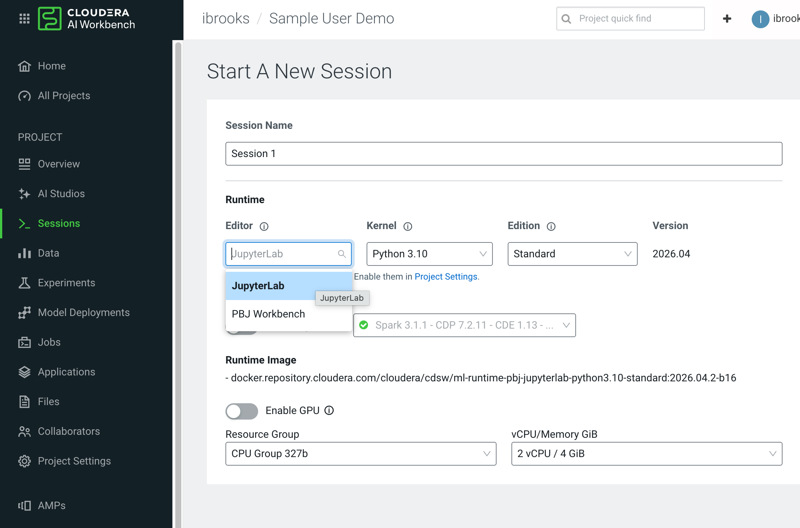
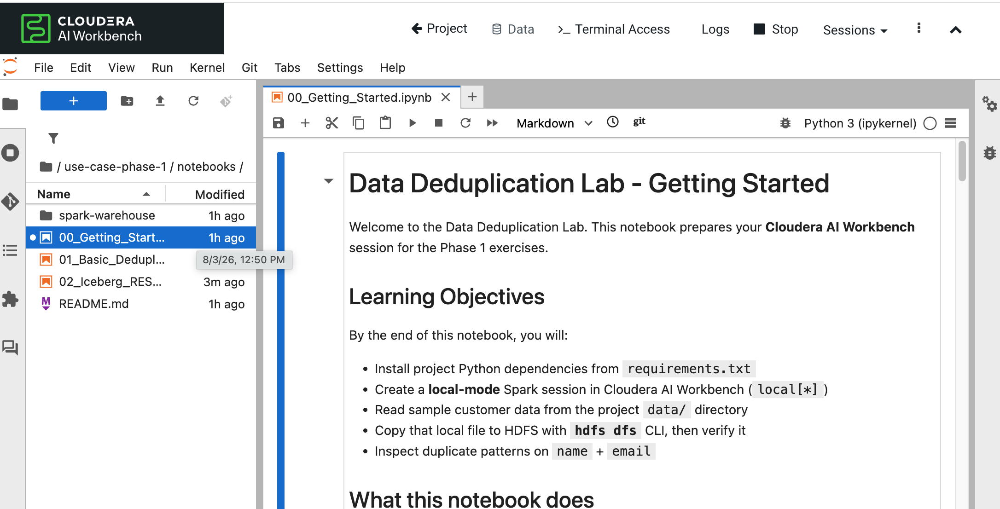
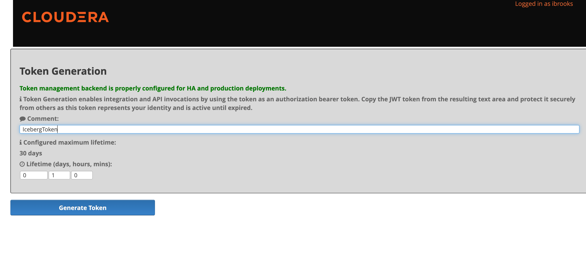
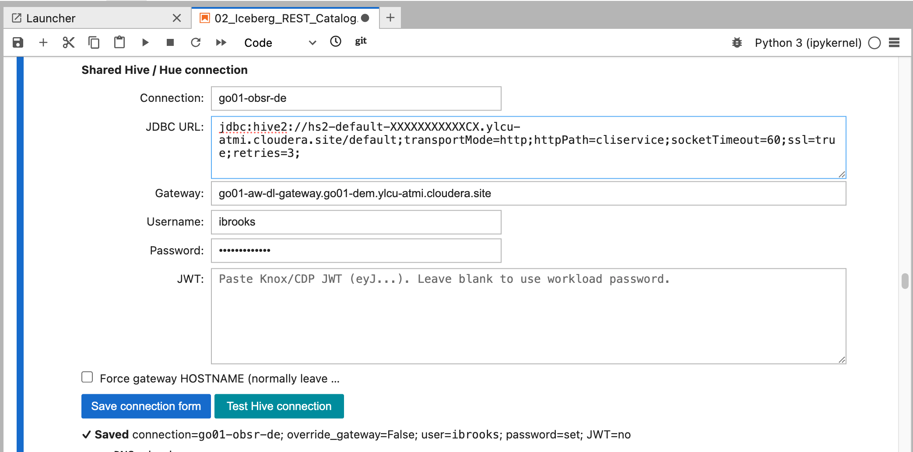
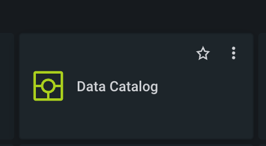
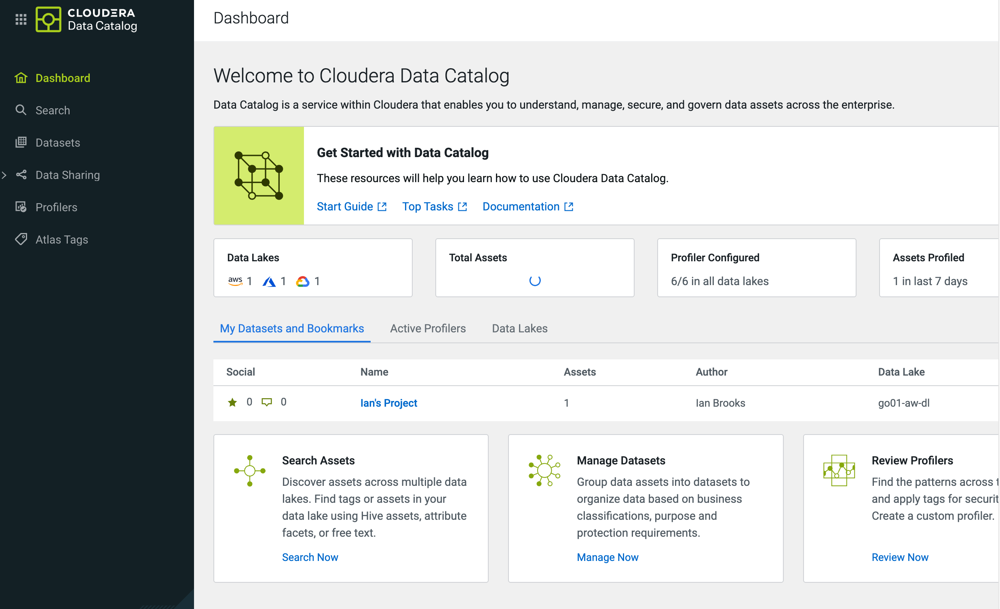
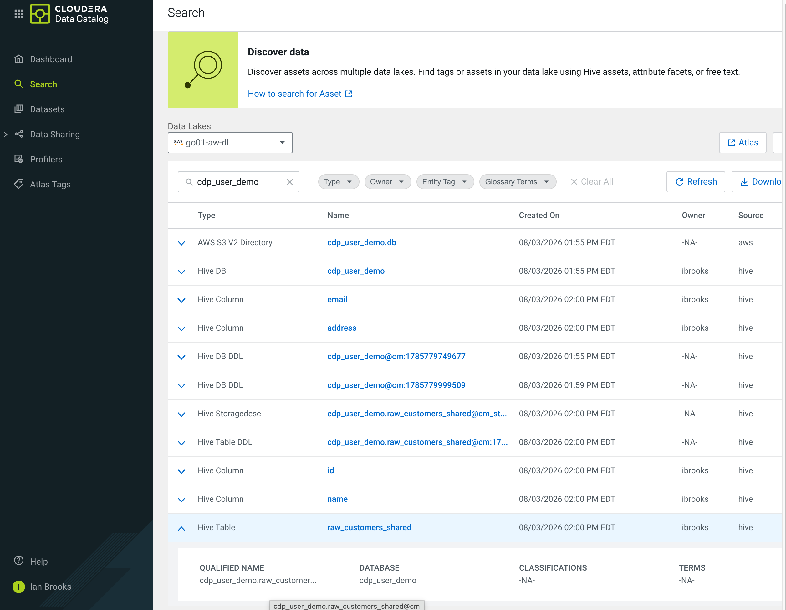
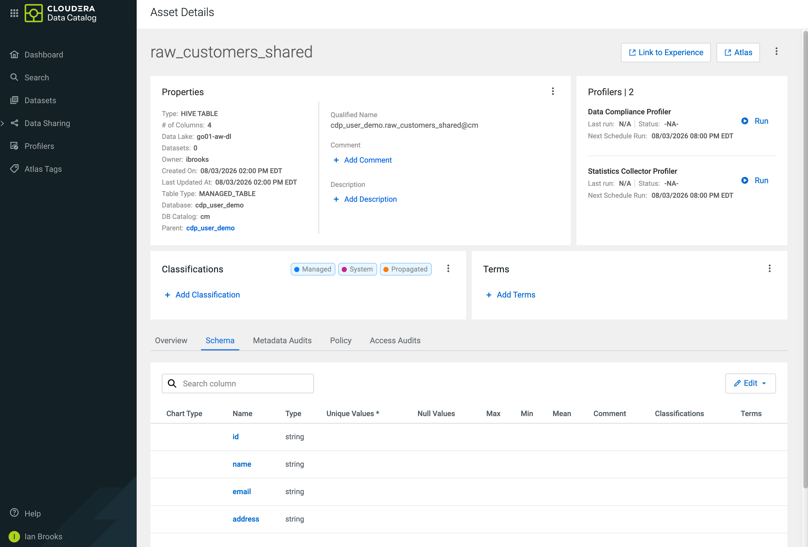

# Phase 1 Use Case — Data Deduplication Lab

CDP user demo materials for Phase 1: prepare sample customer data in Cloudera AI Workbench, deduplicate it with Spark, publish results to a shared CDW warehouse, and verify in Hue.


## Objective

Walk through an end-to-end deduplication flow:

1. Set up a local Spark session and copy sample data to HDFS
2. Remove exact duplicate records
3. Persist results (local Iceberg and/or shared Hive / CDW)
4. Confirm outputs in Hue (File Browser and Table Browser)
5. Verify governance and audit in Data Catalog (discover the shared table, review schema and asset metadata)

## Structure

```
use-case-phase-1/
├── README.md           # This overview
├── hueview.md          # Notebook → Hue verification guide
├── requirements.txt    # Python deps for CAI Workbench sessions
├── data/               # Sample CSVs (redundant customer rows)
├── hadoop-conf/        # Cluster client XML for hdfs dfs / kinit
├── images/             # UI screenshots for setup and Hue
└── notebooks/          # Lab notebooks (run in order)
```

| Path | Purpose |
|------|---------|
| [`notebooks/`](./notebooks/) | Getting Started, dedup, and Iceberg / Hue publish exercises |
| [`data/`](./data/) | Sample inputs (`redundant_data.csv`, larger variant) |
| [`hadoop-conf/`](./hadoop-conf/) | Hadoop / Kerberos client config for HDFS CLI |
| [`images/`](./images/) | Screenshots for CAI session, Hive auth, and Hue |
| [`hueview.md`](./hueview.md) | Steps to verify notebook outputs in Hue |
| [`requirements.txt`](./requirements.txt) | Session package install list |

## Lab flow

| Order | Notebook / doc | What you do |
|------:|----------------|-------------|
| 0 | [`notebooks/00_Getting_Started.ipynb`](./notebooks/00_Getting_Started.ipynb) | Install deps, local Spark, `kinit`, copy CSV to HDFS `/tmp` |
| 1 | [`notebooks/01_Basic_Deduplication.ipynb`](./notebooks/01_Basic_Deduplication.ipynb) | Exact record-level dedup; write results under `/tmp` |
| 2 | [`notebooks/02_Iceberg_REST_Catalog.ipynb`](./notebooks/02_Iceberg_REST_Catalog.ipynb) | Local Iceberg (optional) + publish shared table for Hue |
| 3 | [`hueview.md`](./hueview.md) | Browse HDFS file and query `cdp_user_demo.*_shared` in Hue |
| 4 | Data Catalog (below) | Find `cdp_user_demo.raw_customers_shared` and review schema |

## Prerequisites

- Cloudera AI Workbench session with PySpark and `hdfs` / `kinit` client tools
- Project client XML in [`hadoop-conf/`](./hadoop-conf/) (see that folder’s README)
- Kerberos identity configured in the Getting Started environment cell
- Permission to write HDFS `/tmp`
- For Hue / shared tables: a running CDW Hive Virtual Warehouse and a working CAI Hive Data Connection

## Getting started

### 1. Open the project and start a session

In Cloudera AI Workbench, open this project and click **New Session**.



### 2. Configure the session runtime

Choose **JupyterLab**, **Python 3.10**, and a Spark-enabled runtime image. Start with about **2 vCPU / 4 GiB** unless your environment requires more.



### 3. Open the Phase 1 notebooks

In the session file browser, go to `use-case-phase-1/notebooks/` and run the notebooks in order.



| Notebook | What it does |
|----------|----------------|
| [`00_Getting_Started.ipynb`](./notebooks/00_Getting_Started.ipynb) | Installs deps, creates a local Spark session, loads the sample CSV, runs `kinit`, and copies the file to HDFS `/tmp`. |
| [`01_Basic_Deduplication.ipynb`](./notebooks/01_Basic_Deduplication.ipynb) | Performs exact record-level dedup on `name` + `email`, reports duplicate rates, and writes results under `/tmp` for later notebooks. |
| [`02_Iceberg_REST_Catalog.ipynb`](./notebooks/02_Iceberg_REST_Catalog.ipynb) | Configures the shared Hive connection, optionally writes a local Iceberg table, and publishes `cdp_user_demo.*_shared` for Hue and Data Catalog. |

Complete notebooks **00** and **01** before opening **02**. Notebook 02 depends on the local Spark setup, HDFS sample data, and deduplicated outputs from those first two notebooks.

### 4. Shared Hive / Hue auth (before Exercise 2 publish)

Before Step 0 in `02_Iceberg_REST_Catalog.ipynb`, gather credentials from CDW:

1. Open your Hive Virtual Warehouse details.
2. Use **ACTIONS → Copy JDBC URL**.
3. Optionally open **JWT Auth Token Generator** (or Knox Token Generation) and create a short-lived token.




Paste the JDBC URL and workload password or JWT into the notebook connection form, then **Save** and **Test Hive connection**.



When the Hive connection test succeeds, finish the rest of [`02_Iceberg_REST_Catalog.ipynb`](./notebooks/02_Iceberg_REST_Catalog.ipynb) (local Iceberg optional, then Step 4b publish to the shared warehouse) before moving on to Hue or Data Catalog.

### 5. Verify in Hue

After HDFS copy and/or shared publish, follow [`hueview.md`](./hueview.md) to confirm the file and `cdp_user_demo.*_shared` table in Hue.


### 6. Verify in Data Catalog

After the shared table is published, confirm it is discoverable in Cloudera Data Catalog.

1. From the CDP console, open **Data Catalog**.



2. Land on the Data Catalog dashboard (search, datasets, and profilers).



3. Open **Search**, select your data lake, and search for `cdp_user_demo` (or the shared table name). Select the **Hive Table** `raw_customers_shared`.



4. Open the asset details and review the **Schema** tab (`id`, `name`, `email`, `address`).



## Notes

- Local CAI `/tmp` Parquet and local Iceberg warehouses are **not** visible in Hue.
- Hue sees cluster HDFS (for example `/tmp/redundant_data.csv`) and tables registered in the shared Hive Metastore / CDW (for example `cdp_user_demo.deduped_customers_shared`).
