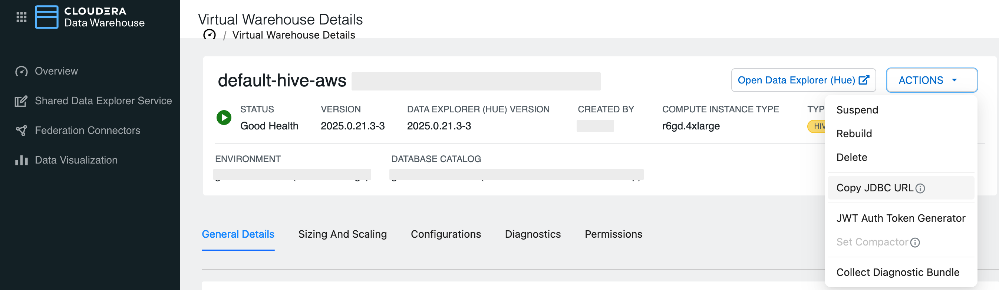
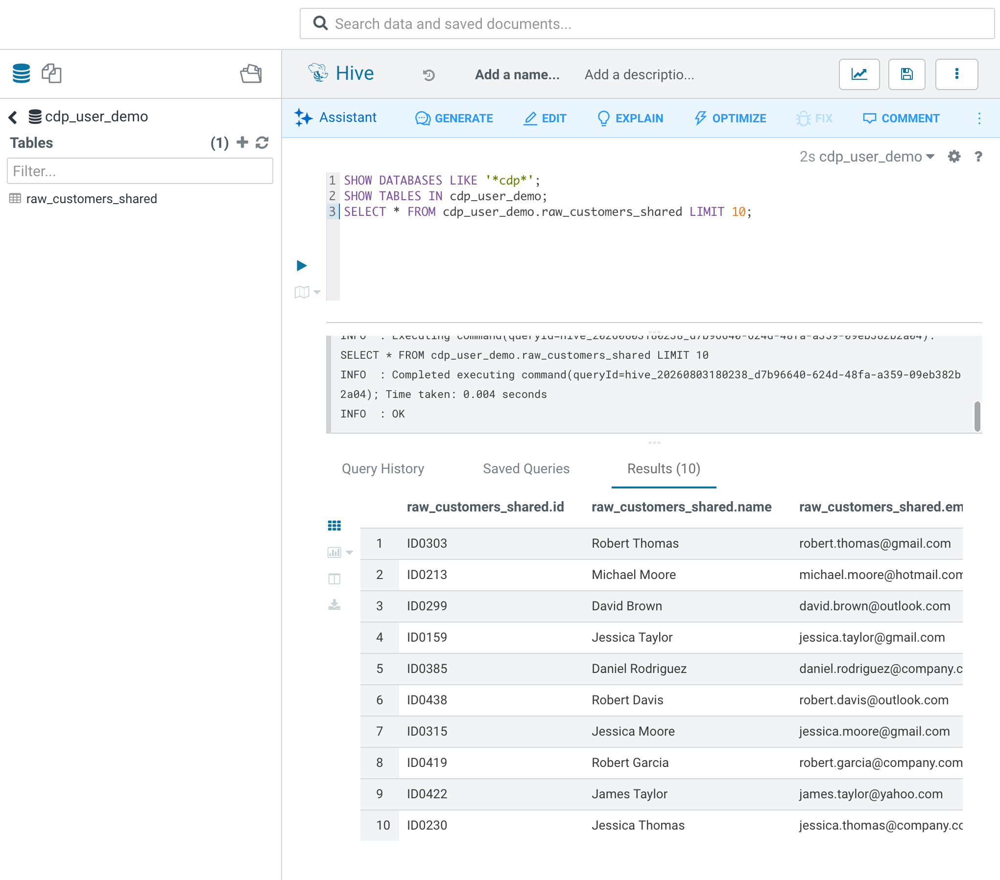

# From Notebook to Hue

Use this guide after the Phase 1 notebooks to verify lab data in **Hue** — Cloudera’s web UI for browsing HDFS and querying Hive / Impala tables in CDW.

## When to use this guide

| After notebook… | What you can verify in Hue |
|-----------------|----------------------------|
| `00_Getting_Started.ipynb` | HDFS file `/tmp/redundant_data.csv` in **File Browser** |
| `02_Iceberg_REST_Catalog.ipynb` (Step 4b) | Shared table `cdp_user_demo.<table>_shared` in **Table Browser** / **Editor** |

> **Important:** Local CAI session paths and local Iceberg warehouses under `/tmp` are **not** visible in Hue. Hue only sees cluster HDFS and tables registered in the shared Hive Metastore / CDW.

## Prerequisites

1. Complete the relevant notebook steps above.
2. For the shared table path: Step 4b in `02_Iceberg_REST_Catalog.ipynb` succeeded (`WRITE_TO_SHARED=true`) and printed a Hue hint such as:
   ```text
   → In Hue: Table Browser → database `cdp_user_demo` → `deduped_customers_shared`
   ```
3. Your CDW Hive Virtual Warehouse is **running** (not suspended).
4. You can sign in to the same CDP environment used by the lab.

## 1. Open Hue

1. In the CDP console, open your **Data Warehouse** (or Environment) experience.
2. Select the Hive Virtual Warehouse used by this lab.
3. Open **Hue** — on the Virtual Warehouse details page, use **Open Data Explorer (Hue)**.



## 2. Browse the HDFS sample file (after Getting Started)

After `00_Getting_Started.ipynb` copies the CSV with `hdfs dfs -put`, confirm it on the cluster:

1. In Hue, open **Files** / **File Browser**.
2. Navigate to `/tmp`.
3. Locate `redundant_data.csv`.
4. Open or preview the file and confirm columns `id`, `name`, `email`, `address`.

Expected path:

```text
/tmp/redundant_data.csv
```

If the file is missing:

- Re-run the HDFS copy cells in `00_Getting_Started.ipynb` (`kinit`, then `hdfs dfs -put`).
- Confirm you are in the same CDP environment / HDFS namespace the notebook used.

## 3. Find the shared table (after Exercise 2)

After Step 4b publishes to the shared warehouse:

1. In Hue, open **Table Browser** (or **Data Catalog** / left-nav tables, depending on your Hue version).
2. Select database **`cdp_user_demo`**.
3. Open the shared table. Defaults:

| Notebook `INPUT_SOURCE` | Shared table (default) |
|-------------------------|------------------------|
| `exercise1_parquet` | `cdp_user_demo.deduped_customers_shared` |
| `local_csv` | `cdp_user_demo.raw_customers_shared` |

Use the exact name printed by Step 4b if you overrode `ICEBERG_NAMESPACE` or `ICEBERG_SHARED_TABLE`.

## 4. Query the table in the Editor

1. Open **Editor** and choose the **Hive** (or Impala) dialect matching your Virtual Warehouse.
2. Run a quick check:

```sql
SHOW TABLES IN cdp_user_demo;

SELECT *
FROM cdp_user_demo.raw_customers_shared
LIMIT 10;
```

Swap in `deduped_customers_shared` if you published from Exercise 1 Parquet.



Optional row-count check:

```sql
SELECT COUNT(*) AS row_count
FROM cdp_user_demo.raw_customers_shared;
```

## 5. What Hue can and cannot see

| Location | Visible in Hue? |
|----------|-----------------|
| HDFS `/tmp/redundant_data.csv` (from notebook CLI `hdfs dfs -put`) | Yes — File Browser |
| Shared Metastore / CDW table `cdp_user_demo.*_shared` | Yes — Table Browser / Editor |
| CAI session local `/tmp/.../exercise1_exact.parquet` | No |
| Local Iceberg warehouse `/tmp/.../iceberg-warehouse` | No |

## Troubleshooting

| Symptom | Likely cause | What to try |
|---------|--------------|-------------|
| No `*_shared` table in `cdp_user_demo` | Step 4b skipped or failed (DNS / VW down) | Re-run Step 0 + 4b in `02_Iceberg_REST_Catalog.ipynb`; start the Hive VW |
| File Browser empty under `/tmp` | HDFS put never ran, or wrong cluster | Re-run Getting Started HDFS cells; confirm environment |
| Query errors on table | Wrong VW / dialect, or table not created | Use the Hive VW tied to the lab Data Connection; `SHOW TABLES IN cdp_user_demo` |
| Expecting local Iceberg table in Hue | Local warehouse is session-only | Publish via Step 4b, or load the CSV in Hue manually |

## Next steps

- Continue the lab narrative in Hue (explore schema, run ad-hoc SQL, compare row counts to notebook output).
- Return to the notebooks for cleanup (`spark.stop()`, optional HDFS / table cleanup per your environment policy).
